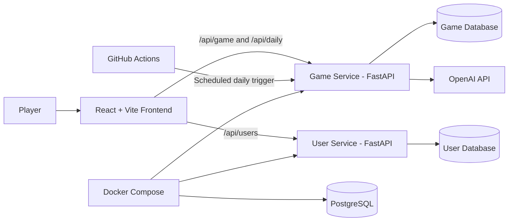

# Quiz Web Game – FYP 2025

Final Year Project – Software & Electronic Engineering  
**Ranger** is an interactive web-based quiz game where players drag and drop question cards onto a number line, placing hidden numerical answers in the correct order.

The project demonstrates a full-stack web application with a React/Vite frontend, FastAPI microservices, SQLAlchemy persistence, PostgreSQL support, OpenAI-generated question sets, automated testing, CI workflows, and a scheduled daily challenge pipeline.

---

## Table of Contents

- [Overview](#overview)
- [Game Rules](#game-rules)
- [Features](#features)
- [Game Modes](#game-modes)
- [Architecture](#architecture)
- [Technology Stack](#technology-stack)
- [Project Structure](#project-structure)
- [API Summary](#api-summary)
- [Database Design](#database-design)
- [OpenAI Question Generation](#openai-question-generation)
- [Daily Challenge Pipeline](#daily-challenge-pipeline)
- [Testing and Coverage](#testing-and-coverage)
- [CI/CD](#cicd)
- [Running the Project Locally](#running-the-project-locally)
- [Running with Docker and PostgreSQL](#running-with-docker-and-postgresql)
- [Environment Variables](#environment-variables)
- [AWS Deployment Attempt](#aws-deployment-attempt)
- [User Feedback Survey](#user-feedback-survey)
- [Known Limitations](#known-limitations)
- [Future Work](#future-work)

---

## Overview

This project implements a numeric-ordering quiz game. The player is shown a question on a draggable card, but the answer is hidden. Each answer is a non-negative integer, such as a year, a quantity, a distance, a count, or another clear numeric fact.

The player must drag the card onto a number line between **0** and **∞**, placing it in the position they believe is correct compared with the cards already on the line. The backend checks whether the placement is valid. If the placement is correct, the card is locked in place and the next question is shown. If the placement is incorrect, the run ends.

Core goals:

- Build an engaging quiz game based on estimation, ordering, and numeric reasoning.
- Demonstrate a full-stack application using React, FastAPI, SQLAlchemy, and PostgreSQL.
- Use server-side validation so the frontend never decides whether an answer is correct.
- Generate structured question sets using the OpenAI API.
- Add daily challenge functionality with a scheduled generation pipeline.
- Apply software engineering practices such as validation, testing, CI, Dockerisation, and clear separation of concerns.

---

## Game Rules

1. The player selects a category and difficulty.
2. The backend generates a session of 8 questions.
3. The frontend displays one current question card at a time.
4. The answer is not shown to the player.
5. The player drags the current card onto the number line.
6. The backend validates the placement using neighbouring cards:
   - First card placed: always valid.
   - Start of line: `placed_answer <= right_answer`.
   - End of line: `left_answer <= placed_answer`.
   - Between two cards: `left_answer <= placed_answer <= right_answer`.
7. Equal answers are allowed.
8. If correct, the card locks into the line and the score increases.
9. If incorrect, the game ends and the player can restart.

---

## Features

- Drag-and-drop gameplay using `@dnd-kit`.
- Number line layout bounded by **0** and **∞**.
- Hidden answers during gameplay.
- Server-side placement validation.
- OpenAI-generated question sets for selected category and difficulty.
- Session-based game generation using a unique `session_id`.
- Classic game mode.
- Daily challenge mode.
- Legacy mode for replaying previous daily challenges.
- Daily category rotation to reduce repeated topics.
- Difficulty cycling across daily challenges.
- User service with registration and CRUD endpoints.
- Game run tracking.
- User statistics including high score, longest streak, average score, and games played.
- Leaderboard endpoint.
- PostgreSQL support through Docker Compose.
- SQLite fallback for simple local development and testing.
- Automated backend tests with pytest.
- HTML and LCOV coverage reports for the Game Service.
- GitHub Actions workflows for CI, coverage artefacts, and daily challenge generation.

---

## Game Modes

### Classic Mode

Classic mode starts a new generated game session. The player chooses a category and difficulty, then the backend calls the OpenAI question generator and stores 8 generated questions under a new session ID.

Frontend route:

```text
/
```

Main frontend file:

```text
ReactApp/src/features/game/QuestionPlacement.jsx
```

Main backend endpoint:

```http
POST /api/game/start
```

---

### Daily Mode

Daily mode provides one shared challenge for the current UTC date. The daily challenge contains 8 generated questions, one category, and one difficulty.

Frontend route:

```text
/daily
```

Main frontend file:

```text
ReactApp/src/features/daily/DailyModePage.jsx
```

Main backend endpoints:

```http
POST /api/daily/generate-today
GET  /api/daily/today
POST /api/daily/validate-placement
```

The generation endpoint is protected using the `X-Daily-Job-Token` header so that only the scheduled job or an authorised manual request can create the daily challenge.

---

### Legacy Mode

Legacy mode allows players to view and replay previous successful daily challenges. This gives the game more replay value because older daily challenges remain accessible instead of being lost after the current day ends.

Frontend route:

```text
/legacy
```

Main frontend file:

```text
ReactApp/src/features/legacy/LegacyModePage.jsx
```

Main backend endpoints:

```http
GET /api/daily/history
GET /api/daily/history/{challenge_date}
```

---

## Architecture

The system is split into a frontend and two backend services.



### Game Service

The Game Service owns the main quiz logic.

Responsibilities:

- Question CRUD operations.
- Starting generated game sessions.
- Placement validation.
- Daily challenge generation.
- Daily challenge retrieval.
- Legacy challenge retrieval.
- Game run storage.
- User statistics and leaderboard queries.

Main files:

```text
Game_Service/app/GameMain.py
Game_Service/app/DailyMode.py
Game_Service/app/GameModels.py
Game_Service/app/GameSchemas.py
Game_Service/app/GameDatabase.py
Game_Service/app/QuestionGenerator.py
```

Default local port:

```text
8001
```

Docker host port:

```text
8002
```

---

### User Service

The User Service owns user account data.

Responsibilities:

- Create users.
- List users.
- Retrieve users by ID.
- Update users.
- Delete users.
- Validate user input using Pydantic.

Main files:

```text
User_Service/app/UserMain.py
User_Service/app/UserModels.py
User_Service/app/UserSchemas.py
User_Service/app/UserDatabase.py
```

Default local port:

```text
8000
```

---

### Frontend

The frontend is a React single-page application built with Vite. It displays the game interface, handles drag-and-drop interaction, manages local gameplay state, and sends validation requests to the backend.

Main files:

```text
ReactApp/src/App.jsx
ReactApp/src/routes/AppRoutes.jsx
ReactApp/src/features/game/QuestionPlacement.jsx
ReactApp/src/features/daily/DailyModePage.jsx
ReactApp/src/features/legacy/LegacyModePage.jsx
ReactApp/src/components/layout/TopBar.jsx
ReactApp/src/components/layout/FooterBar.jsx
```

Default local port:

```text
5173
```

---

## Technology Stack

### Frontend

- React
- Vite
- React Router
- Axios
- Fetch API
- `@dnd-kit/core`
- `@dnd-kit/sortable`
- `@dnd-kit/utilities`
- `react-icons`
- CSS modules/files for component styling
- ESLint

### Backend

- Python 3.11+
- FastAPI
- Pydantic v2
- SQLAlchemy 2.x
- Uvicorn
- Gunicorn
- python-dotenv
- OpenAI Python SDK
- pytest
- pytest-cov

### Database

- PostgreSQL 16 through Docker Compose
- SQLite fallback for simple local development
- In-memory SQLite for tests using `StaticPool`

### DevOps and Tooling

- Docker
- Docker Compose
- GitHub Actions
- Makefile
- LCOV coverage output
- HTML coverage reports

---

## Project Structure

```text
Quiz_Web_Game_FYP2025/
│
├── Game_Service/
│   ├── app/
│   │   ├── DailyMode.py
│   │   ├── GameDatabase.py
│   │   ├── GameMain.py
│   │   ├── GameModels.py
│   │   ├── GameSchemas.py
│   │   └── QuestionGenerator.py
│   ├── tests/
│   │   ├── conftest.py
│   │   ├── test_daily_mode.py
│   │   ├── test_game_endpoints.py
│   │   ├── test_gameplay_endpoints.py
│   │   └── test_runs_stats_endpoints.py
│   └── Dockerfile
│
├── User_Service/
│   ├── app/
│   │   ├── UserDatabase.py
│   │   ├── UserMain.py
│   │   ├── UserModels.py
│   │   └── UserSchemas.py
│   ├── tests/
│   │   ├── conftest.py
│   │   └── test_users.py
│   └── Dockerfile
│
├── ReactApp/
│   ├── src/
│   │   ├── components/layout/
│   │   ├── features/daily/
│   │   ├── features/game/
│   │   ├── features/legacy/
│   │   ├── routes/
│   │   └── styles/
│   ├── package.json
│   └── vite.config.js
│
├── db/
│   └── init.sql
│
├── .github/workflows/
│   ├── ci.yml
│   ├── daily-challenge.yml
│   └── game-service-coverage.yml
│
├── coverage/
│   └── game_service.lcov
│
├── docker-compose.yml
├── Makefile
├── requirements.txt
├── pytest.ini
└── README.md
```

---

## API Summary

### Game Service

| Method | Endpoint | Purpose |
|---|---|---|
| `GET` | `/health` | Health check |
| `GET` | `/api/questions` | List all questions |
| `POST` | `/api/questions` | Create a question manually |
| `GET` | `/api/questions/random` | Fetch a random question with optional filters |
| `GET` | `/api/questions/{question_id}` | Fetch one question including answer |
| `PUT` | `/api/questions/{question_id}` | Fully update a question |
| `PATCH` | `/api/questions/{question_id}` | Partially update a question |
| `DELETE` | `/api/questions/{question_id}` | Delete a question |
| `POST` | `/api/game/start` | Generate and store a new 8-question game session |
| `POST` | `/api/game/validate-placement` | Validate a classic-mode card placement |
| `POST` | `/api/users/{user_id}/runs` | Store a completed game run |
| `GET` | `/api/users/{user_id}/stats` | Get user statistics |
| `GET` | `/api/leaderboard` | Get leaderboard entries |

### Daily and Legacy Endpoints

| Method | Endpoint | Purpose |
|---|---|---|
| `POST` | `/api/daily/generate-today` | Generate today's daily challenge |
| `GET` | `/api/daily/today` | Fetch today's daily challenge |
| `POST` | `/api/daily/validate-placement` | Validate a daily-mode card placement |
| `GET` | `/api/daily/history` | List previous successful daily challenges |
| `GET` | `/api/daily/history/{challenge_date}` | Fetch one previous daily challenge |
| `GET` | `/api/daily/categories` | List daily categories |
| `POST` | `/api/daily/categories` | Add a daily category |

### User Service

| Method | Endpoint | Purpose |
|---|---|---|
| `GET` | `/health` | Health check |
| `GET` | `/api/users` | List users |
| `POST` | `/api/users` | Create user |
| `GET` | `/api/users/{user_id}` | Fetch user by ID |
| `PUT` | `/api/users/{user_id}` | Update user |
| `DELETE` | `/api/users/{user_id}` | Delete user |

---

## Database Design

The project uses SQLAlchemy ORM models. The Game Service and User Service are separated so that each service owns its own data.

### Game Service Tables

| Table | Purpose |
|---|---|
| `questions` | Stores classic/generated game questions |
| `game_runs` | Stores completed game results for stats and leaderboard data |
| `daily_categories` | Stores categories used by the daily challenge generator |
| `daily_challenges` | Stores one daily challenge record per date |
| `daily_questions` | Stores the generated questions belonging to a daily challenge |

### User Service Tables

| Table | Purpose |
|---|---|
| `users` | Stores user account details |

The Docker setup creates two PostgreSQL databases on first initialisation:

```sql
CREATE DATABASE game_db;
CREATE DATABASE user_db;
```

---

## OpenAI Question Generation

The project uses the OpenAI API to generate numeric trivia questions.

The generator is implemented in:

```text
Game_Service/app/QuestionGenerator.py
```

The generation function:

```python
generate_questions(category="History", difficulty="easy", count=8)
```

Important safeguards:

- The model must return exactly the requested number of questions.
- Every answer must be a single integer greater than or equal to 0.
- No decimals, ranges, lists, or approximate answers are allowed.
- Questions must clearly state what the number represents and include the unit where needed.
- Duplicate prompts and duplicate answers are avoided.
- Output is parsed into a Pydantic schema before being stored.
- The backend overwrites the returned category and difficulty with the requested values to avoid model drift.
- Public gameplay responses exclude the answer field so the frontend cannot reveal the answer during play.

---

## Daily Challenge Pipeline

The daily challenge pipeline is defined in:

```text
.github/workflows/daily-challenge.yml
```

The workflow runs at midnight UTC:

```yaml
cron: "0 0 * * *"
```

Pipeline flow:

1. GitHub Actions starts on the daily cron schedule or manual dispatch.
2. The repository is checked out.
3. Python 3.11 is installed.
4. Project dependencies are installed from `requirements.txt`.
5. Game Service tests are run.
6. If tests pass, GitHub Actions sends a POST request to the deployed daily generation endpoint.
7. The request includes the `X-Daily-Job-Token` secret header.
8. The backend checks whether a successful challenge already exists for the current UTC date.
9. If no challenge exists, the backend selects an unused category, calculates the difficulty for that date, generates 8 questions, stores them, and marks the challenge as `success`.
10. If generation fails, the challenge is marked as `failed` and the workflow can notify the admin through the configured Formspree endpoint.

The daily generation endpoint is idempotent. If today's challenge already exists and has status `success`, it returns `already_exists` instead of creating duplicate daily questions.

---

## Testing and Coverage

Automated backend tests are included for both services.

### Game Service Tests

Located in:

```text
Game_Service/tests/
```

Coverage includes:

- Health check endpoint.
- Question creation, retrieval, update, patch, delete, and validation errors.
- Random question retrieval.
- OpenAI game session start flow using mocked generated questions.
- Handling OpenAI generation failures.
- Placement validation with no neighbours, left neighbour, right neighbour, and both neighbours.
- 404 cases for missing placed/left/right question IDs.
- Game run creation.
- User stats aggregation.
- Leaderboard ranking.
- Daily challenge generation.
- Daily challenge idempotency.
- Daily challenge retrieval.
- Daily placement validation.
- Daily category behaviour.

### User Service Tests

Located in:

```text
User_Service/tests/
```

Coverage includes:

- Creating users.
- Fetching users.
- Handling missing users.
- Duplicate user conflict handling.
- Pydantic validation for invalid names, passwords, ages, and emails.
- Updating and deleting users.

### Test Database Approach

Tests use an in-memory SQLite database:

```text
sqlite+pysqlite:///:memory:
```

`StaticPool` is used so the same in-memory database connection is shared across the FastAPI `TestClient` session. This allows tests to run quickly without requiring a local PostgreSQL instance.

### Running Tests

Run all tests:

```bash
make test
```

Run only Game Service tests:

```bash
make test-game
```

Run Game Service tests with terminal, HTML, and LCOV coverage reports:

```bash
make coverage-game
```

Current included Game Service LCOV report:

```text
328 / 342 lines covered
95.9% line coverage
```

Generated coverage artefacts:

```text
htmlcov/game_service/
coverage/game_service.lcov
```

---

## CI/CD

GitHub Actions workflows are included under:

```text
.github/workflows/
```

| Workflow | Purpose |
|---|---|
| `ci.yml` | Runs Game Service tests with coverage on pushes and pull requests to `main` |
| `game-service-coverage.yml` | Generates HTML and LCOV coverage artefacts on every branch push, manual dispatch, and daily schedule |
| `daily-challenge.yml` | Runs tests and triggers daily challenge generation at midnight UTC |

The project therefore has both standard CI testing and a scheduled operational workflow for generating the daily challenge.

---

## Running the Project Locally

### 1. Clone the repository

```bash
git clone <repository-url>
cd Quiz_Web_Game_FYP2025
```

### 2. Create and activate a Python virtual environment

Windows PowerShell:

```powershell
python -m venv .venv
.\.venv\Scripts\Activate.ps1
```

macOS/Linux:

```bash
python3 -m venv .venv
source .venv/bin/activate
```

### 3. Install backend dependencies

```bash
pip install -r requirements.txt
```

### 4. Add environment variables

Create a `.env` file in the project root. For simple SQLite local development, the database URLs can be omitted because the services fall back to local SQLite files.

For OpenAI-generated questions, add:

```env
OPENAI_API_KEY=your_openai_api_key
OPENAI_MODEL=gpt-5-mini
DAILY_JOB_TOKEN=your_daily_job_token
```

### 5. Run the Game Service

```bash
make runGame
```

Game Service:

```text
http://localhost:8001
```

Interactive API docs:

```text
http://localhost:8001/docs
```

### 6. Run the User Service

Open a second terminal:

```bash
make runUsers
```

User Service:

```text
http://localhost:8000
```

Interactive API docs:

```text
http://localhost:8000/docs
```

### 7. Run the frontend

Open a third terminal:

```bash
cd ReactApp
npm install
npm run dev
```

Frontend:

```text
http://localhost:5173
```

The Vite proxy currently forwards `/api` requests to:

```text
http://localhost:8001
```

This matches the local `make runGame` setup.

---

## Running with Docker and PostgreSQL

The project includes Dockerfiles for both backend services and a `docker-compose.yml` file for PostgreSQL, Game Service, and User Service.

### 1. Create a `.env` file

Example:

```env
POSTGRES_USER=postgres
POSTGRES_PASSWORD=postgres

GAME_DATABASE_URL=postgresql+psycopg2://postgres:postgres@db:5432/game_db
DATABASE_URL=postgresql+psycopg2://postgres:postgres@db:5432/user_db

OPENAI_API_KEY=your_openai_api_key
OPENAI_MODEL=gpt-5-mini
DAILY_JOB_TOKEN=your_daily_job_token
```

### 2. Start the containers

```bash
docker compose up --build
```

Docker ports:

| Service | Container Port | Host Port |
|---|---:|---:|
| Game Service | `8001` | `8002` |
| User Service | `8000` | `8000` |
| PostgreSQL | `5432` | `5432` bound to localhost |

Game Service in Docker:

```text
http://localhost:8002
```

User Service in Docker:

```text
http://localhost:8000
```

### Important frontend note when using Docker

The frontend proxy currently targets:

```text
http://localhost:8001
```

If the Game Service is running through Docker Compose, it is exposed on host port `8002`, so either:

1. Change the target in `ReactApp/vite.config.js` to `http://localhost:8002`, or
2. Run the Game Service locally with `make runGame` on port `8001`.

### Stop Docker containers

```bash
docker compose down
```

### Reset the PostgreSQL volume

This deletes the database volume and recreates the databases from `db/init.sql` on the next startup:

```bash
docker compose down -v
docker compose up --build
```

---

## Environment Variables

| Variable | Used By | Purpose |
|---|---|---|
| `OPENAI_API_KEY` | Game Service | Allows the backend to call the OpenAI API |
| `OPENAI_MODEL` | Game Service | Selects the OpenAI model used for question generation |
| `DAILY_JOB_TOKEN` | Game Service / GitHub Actions | Protects the daily challenge generation endpoint |
| `GAME_DATABASE_URL` | Game Service | SQLAlchemy database URL for game data |
| `DATABASE_URL` | User Service | SQLAlchemy database URL for user data |
| `POSTGRES_USER` | Docker/PostgreSQL | PostgreSQL username |
| `POSTGRES_PASSWORD` | Docker/PostgreSQL | PostgreSQL password |
| `DAILY_TRIGGER_URL` | GitHub Actions secret | URL called by the daily challenge workflow |
| `FORMSPREE_ENDPOINT` | GitHub Actions secret | Optional failure notification endpoint |

---

## AWS Deployment Attempt

An AWS student server was used as a deployment target during development. The goal was to run the backend services outside the local development environment and trigger the daily generation endpoint remotely.

Work completed:

- Investigated deployment of the FastAPI backend on an AWS student server.
- Used Docker/Docker Compose as the intended deployment approach.
- Considered how the GitHub Actions daily challenge workflow would call the deployed backend.
- Manually tested backend-style workflows using HTTP requests.

Current status:

- Full production deployment is not yet complete.
- No formal deployment testing has been completed.
- AWS work is treated as an implementation attempt and learning outcome rather than a finished production release.

This is useful evidence for the project because it shows consideration of real deployment constraints, environment variables, service ports, remote backend access, and scheduled automation.

---

## User Feedback Survey

A user feedback survey was created for classmates after testing the game.

The survey is intended to evaluate:

- Whether the rules are easy to understand.
- Whether drag-and-drop feels intuitive.
- Whether the game is enjoyable.
- Whether the difficulty is suitable.
- Whether players would replay daily or legacy challenges.
- Any bugs or confusing parts of the interface.

This survey supports the evaluation section of the project by adding user-centred feedback alongside automated technical testing.

---

## Known Limitations

- Full AWS deployment is not yet complete.
- Deployment testing has not yet been completed.
- Frontend automated tests are not currently included.
- User authentication is represented through user CRUD functionality, but full login/session security is not yet implemented.
- The frontend proxy target must be adjusted if switching between local backend port `8001` and Docker backend port `8002`.
- OpenAI question quality depends on prompt design and external API availability.
- The current daily challenge schedule uses UTC, which may differ slightly from local Irish time depending on daylight saving time.

---

## Future Work

Planned improvements:

- Complete deployment on a stable production server rather than only an AWS student environment.
- Add formal deployment tests and smoke tests.
- Add frontend unit/component tests.
- Add end-to-end tests for full gameplay flows.
- Add user authentication and secure password hashing.
- Add a persistent player profile system.
- Improve leaderboard integration with real usernames.
- Add more analytics from survey results and gameplay data.
- Add mobile-friendly styling or a mobile app version.
- Add admin tools for reviewing generated questions.
- Add stronger safeguards for generated question accuracy.

---

## Author

Nathan McCormack  
Final Year Project – Software & Electronic Engineering  
Atlantic Technological University Galway
